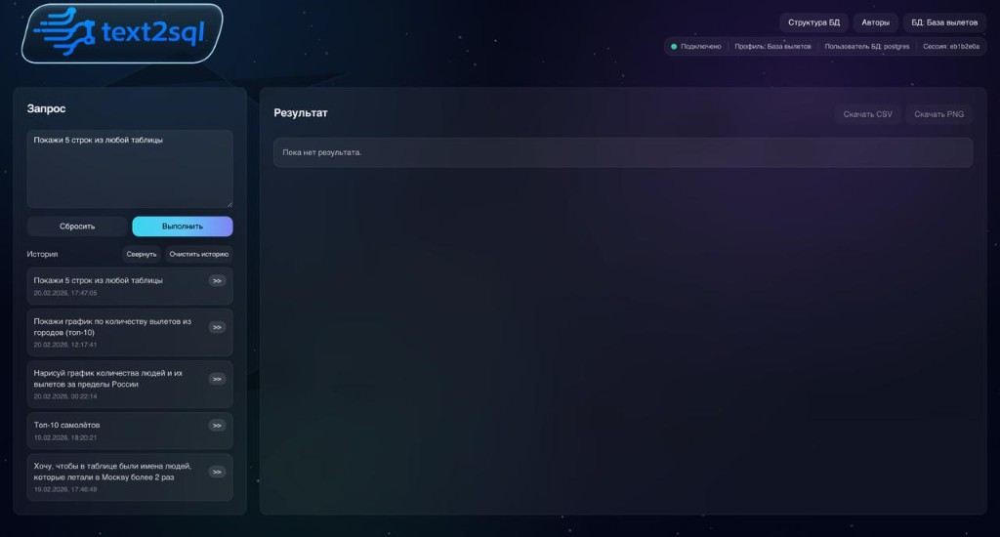
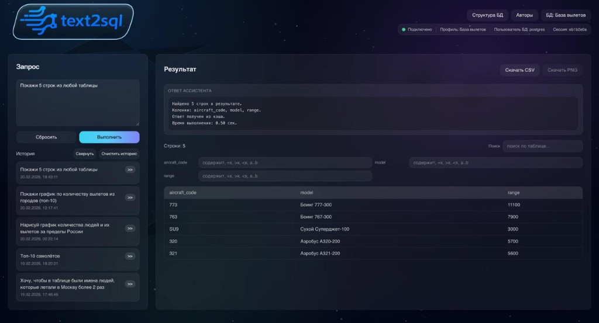
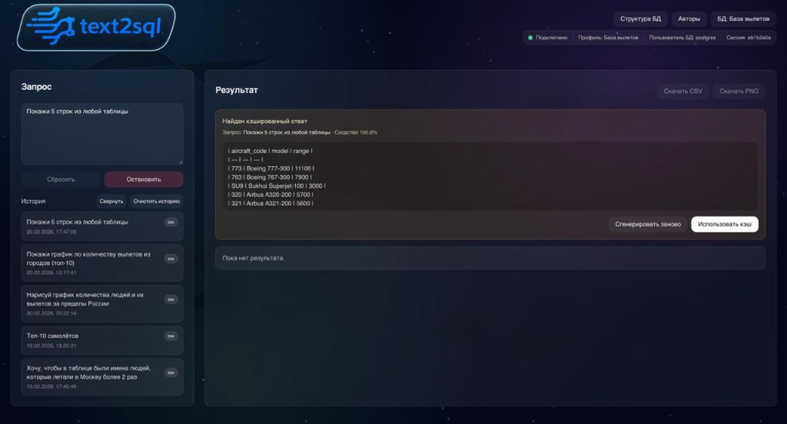
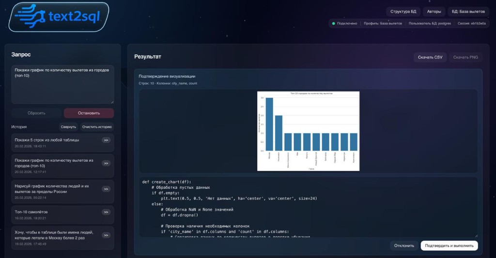
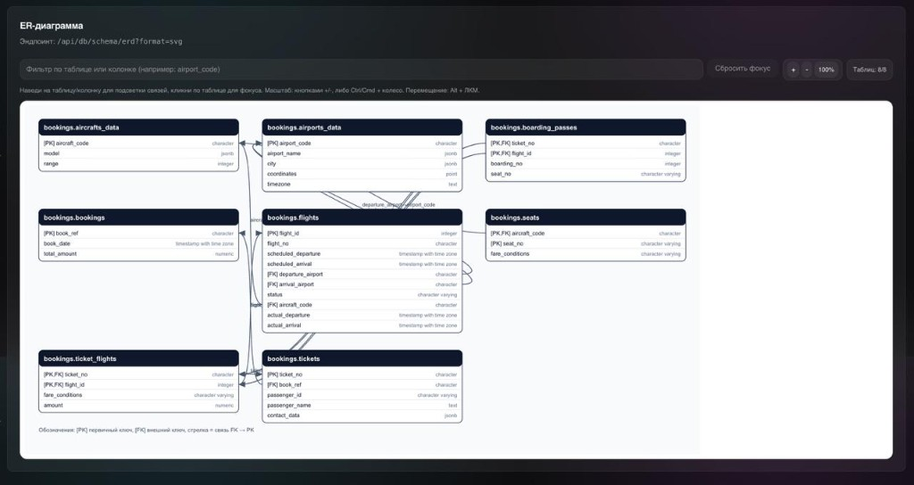
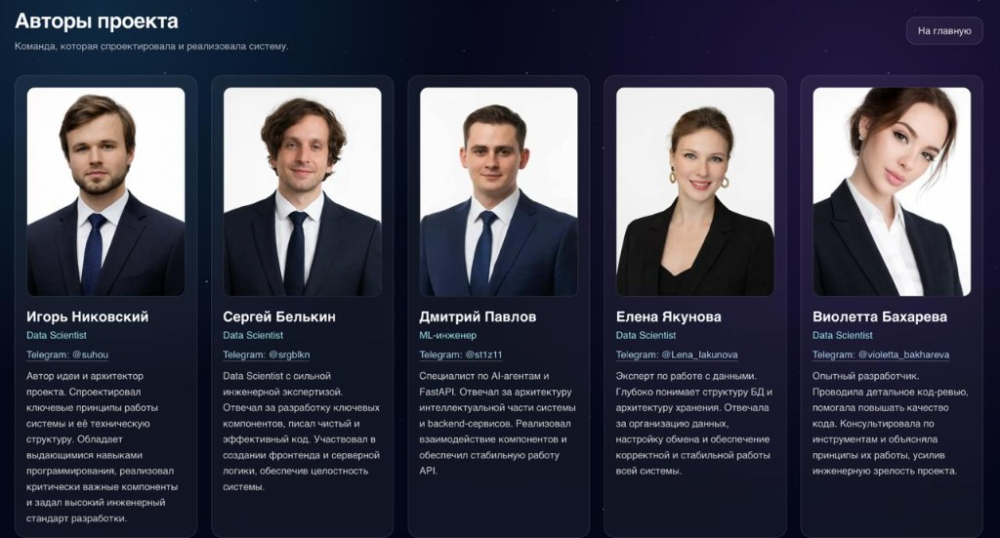

# Multiagents-system

AI-система для работы с PostgreSQL на естественном языке: пользователь задаёт вопрос, backend строит SQL через LangGraph-агентов, возвращает таблицу/инсайты, а при необходимости строит визуализацию.  
Проект состоит из `FastAPI` backend и `Next.js` frontend.

<div align="center">
  <a href="https://text2sql.ru" target="_blank">
    
  </a>
</div>

## Визуальный обзор сервиса

<p align="center">
  
</p>

<p align="center">
  
  
</p>

<p align="center">
  
  
</p>

<p align="center">
  
</p>

## Возможности

- Чат с БД на русском/английском языке.
- Динамическое подключение к PostgreSQL из UI (`/db/connect`).
- Генерация SQL через граф агентов (LangGraph + LLM).
- Кэширование похожих запросов в Qdrant (semantic cache).
- Human-in-the-loop: подтверждение использования кэша/этапов визуализации.
- Просмотр схемы БД и ERD (`SVG`/`DOT`) в интерфейсе.

## Архитектура

### Backend (`/backend`)

- `FastAPI` API-сервис (`app.py`).
- Граф агентов (`agent/graph.py`) на `LangGraph`.
- Работа с PostgreSQL (`database.py`, `psycopg2` pool).
- Кэш в Qdrant (`qdrant.py`) + embeddings.
- Генерация и безопасный рендер графиков (`visual.py`, matplotlib/seaborn).

### Frontend (`/frontend`)

- `Next.js` (App Router) + TypeScript + Tailwind.
- Главный UI чата и подключения профилей БД (`app/page.tsx`).
- Страница схемы/ERD (`app/db-schema/page.tsx`).
- Страница авторов (`app/authors/page.tsx`).
- API-клиент к backend (`lib/api.ts`).

## Технологии

- **Backend:** Python, FastAPI, LangGraph, LangChain, Groq, Qdrant, psycopg2, pandas, matplotlib, seaborn.
- **Frontend:** Next.js, React, TypeScript, Tailwind CSS, Radix UI.
- **Data Layer:** PostgreSQL + векторный кэш Qdrant.

## Структура проекта

```text
Multiagents-system/
├── backend/
│   ├── app.py
│   ├── config.py
│   ├── database.py
│   ├── qdrant.py
│   ├── visual.py
│   ├── requirements.txt
│   └── agent/
│       ├── graph.py
│       └── state.py
├── frontend/
│   ├── app/
│   │   ├── page.tsx
│   │   ├── db-schema/page.tsx
│   │   └── authors/page.tsx
│   ├── lib/api.ts
│   ├── package.json
│   └── .env.example
├── docs/
│   └── images/
│       ├── screen-home.png
│       ├── screen-result.png
│       ├── screen-cache.png
│       ├── screen-chart.png
│       ├── screen-erd.png
│       └── screen-authors.png
└── .gitignore
```

## Требования

- Python `3.11+` (рекомендуется `3.12`).
- Node.js `20+` и npm.
- Доступ к PostgreSQL.
- (Опционально) доступ к Qdrant Cloud/local.
- API-ключ Groq для LLM.

## Переменные окружения

### Backend (`backend/.env`)

`config.py` использует следующие переменные:

| Переменная | Обязательна | Назначение |
|---|---:|---|
| `GROQ_API_KEY` | Да | Ключ для LLM (Groq) |
| `QDRANT_URL` | Нет | URL Qdrant |
| `QDRANT_API` | Нет | API key Qdrant |
| `DATABASE_URL` / `DB_URL` | Нет | DSN для PostgreSQL (альтернатива параметрам ниже) |
| `DB_HOST`, `DB_PORT`, `DB_NAME`, `DB_USER`, `DB_PASSWORD` | Нет | Параметры БД при отсутствии DSN |
| `DB_CONNECT_TIMEOUT` | Нет | Таймаут подключения (сек) |
| `DB_POOL_MIN_CONN`, `DB_POOL_MAX_CONN` | Нет | Размер пула соединений |
| `CORS_ORIGINS` | Нет | Origins через запятую, например `https://app.example.com,http://localhost:3000` |

Пример:

```env
GROQ_API_KEY=your_groq_key
QDRANT_URL=https://your-qdrant
QDRANT_API=your_qdrant_api_key
DB_HOST=127.0.0.1
DB_PORT=5432
DB_NAME=demo
DB_USER=postgres
DB_PASSWORD=postgres
CORS_ORIGINS=http://localhost:3000
```

### Frontend (`frontend/.env.local`)

Используется:

```env
NEXT_PUBLIC_API_BASE_URL=http://127.0.0.1:8000
```

Можно стартовать и через прокси-путь `/backend` (если настроен reverse proxy).

## Локальный запуск

### 1) Backend

```bash
cd backend
python -m venv .venv
source .venv/bin/activate
pip install -r requirements.txt
python app.py
```

Backend поднимется на `http://0.0.0.0:8000`.

### 2) Frontend

```bash
cd frontend
npm install
npm run dev
```

Frontend поднимется на `http://localhost:3000`.

## Ключевые API endpoint'ы

| Метод | Endpoint | Назначение |
|---|---|---|
| `GET` | `/health` | Health + статус подключения к БД |
| `GET` | `/db/status` | Текущий DB status |
| `POST` | `/db/connect` | Подключение к БД по профилю |
| `POST` | `/db/disconnect` | Отключение от БД |
| `POST` | `/auth/login` | UI-совместимый login |
| `GET` | `/auth/me` | Информация о текущем пользователе/подключении |
| `GET` | `/api/db/schema` | Структура БД (таблицы, колонки, ключи, индексы) |
| `GET` | `/api/db/schema/erd` | ERD (`format=svg|dot`) |
| `POST` | `/chat` | Основной чат-запрос |
| `POST` | `/chat/resume` | Продолжение диалога после interrupt |

## Как это работает (коротко)

1. Пользователь отправляет вопрос из frontend.
2. Backend вызывает граф агентов (`LangGraph`).
3. Агент генерирует/выполняет SQL и получает данные.
4. Если найден релевантный кэш в Qdrant — может запросить подтверждение пользователя.
5. Ответ возвращается как текст + табличные данные (+ график в base64 при визуализации).

## Проверка и качество

```bash
# Frontend сборка
cd frontend && npm run build

# Проверка backend импорта
cd backend && python -c "from app import app; print('OK')"
```

## Безопасность

- Не коммитьте секреты (`.env`, `.env.local`, API keys).
- При утечке ключей обязательно выполните ротацию ключей (Groq, Qdrant, DB credentials).
- Для production рекомендованы HTTPS, ограничение CORS и отдельные service-accounts.

## Деплой (базовый план)

- **Backend:** Docker/VPS/Cloud Run/Fly/Render (Uvicorn + reverse proxy).
- **Frontend:** Vercel/Netlify/self-hosted Node.
- **Интеграция:** `NEXT_PUBLIC_API_BASE_URL` указывает на публичный backend URL.

## Roadmap (рекомендации)

- Добавить `backend/.env.example`.
- Добавить автотесты для endpoint'ов (`pytest` + `httpx`).
- Добавить централизованный `docker-compose` для PostgreSQL + Qdrant + backend + frontend.
- Ужесточить ESLint/TypeScript в frontend (сейчас есть `any` в нескольких местах).

---
